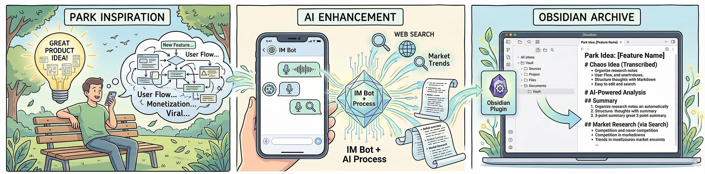
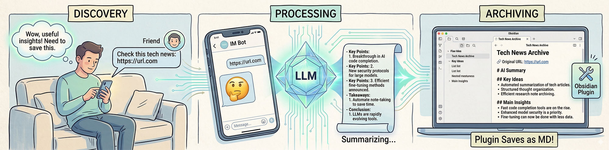

# AI Idea Capture

---

[English](#english-documentation) | [简体中文](#chinese-documentation)

---

## 🚀 AI Idea Capture

An Obsidian plugin that seamlessly connects to Telegram/Discord, using AI (LLMs, Vision, STT, Web Search) to refine your chaotic thoughts, voice notes, and images into structured Obsidian notes automatically.

### 🛡️ Privacy & Security Notice
**Important**: This plugin acts as a client connecting your IM app (Telegram/Discord) directly to the third-party AI services you configure.
1. **Your data is sent to the LLM providers** (e.g., OpenAI, Google, Anthropic, or any custom API) you specify in the settings to process text, audio, and images.
2. **Local First**: The plugin has no central backend. API keys and chat histories are processed locally and securely encrypted (AES-256) inside your Obsidian Vault.

### ✨ Features
- **Multi-Modal Input**: Send text, photos, voice messages, or URLs to your Telegram bot.
- **Auto-Archiving**: Stop typing for 5 minutes (customizable), and the plugin will auto-summarize the session into a neat Markdown file in your Vault.
- **Smart Awakening**: Remembers recent contexts across sessions.
- **12 Languages Supported**: UI and AI Prompts auto-align with your Obsidian language setting.

### ⚙️ How to use
1. Create a Bot via [BotFather](https://t.me/botfather) in Telegram, or [Discord Developer Portal](https://discord.com/developers/applications) (Enable **Message Content Intent** in Bot settings).
2. Put the Bot Token in the plugin settings.
3. Set up your AI models (LLM, STT, Vision, Search).
4. Send `/activate` to your bot and enter the code shown in Obsidian to bind your device.
5. Start sending your ideas!

---

## 🚀 AI Idea Capture

一款深度集成 Telegram / Discord 的 Obsidian 插件。它利用大模型（LLM）、语音转写（STT）、视觉识别（Vision）和联网搜索，将你碎片化的灵感、语音和图片，自动提炼为结构化的 Obsidian 笔记。

### 🛡️ 隐私与安全声明
**重要提示**：本插件是一个纯本地客户端，它将您的聊天软件直接连接到您配置的第三方 AI 服务商。
1. **数据流向**：为了提炼和分析，**您的聊天内容、语音和图片将被发送给您在设置中配置的 AI 服务商**（如 OpenAI, 智谱, Kimi, 小米, 本地大模型等）。
2. **本地优先**：本插件**没有**任何中心化服务器。所有的 API Key 和临时对话都在本地（Obsidian）处理，且 API Key 会进行 AES-256 本地高强度加密。

### ✨ 核心功能
- **全模态捕获**：支持发送文字、语音、图片和网页链接。
- **无感归档**：停止输入 5 分钟（可调）后，自动为您生成结构化的 Markdown 笔记并存入 Inbox。
- **跨会话唤醒**：智能比对上下文，跨时间接续之前的灵感。
- **12 语种支持**：UI 和底层 Prompt 提示词自动跟随您的 Obsidian 语言设置。

### ⚙️ 如何使用
1. 在 Telegram 中通过 [BotFather](https://t.me/botfather) 创建机器人，或在 [Discord Developer Portal](https://discord.com/developers/applications) 创建（需在 Bot 设置中开启 **Message Content Intent**）。
2. 在插件设置中填入 Bot Token。
3. 配置您喜欢的大模型（LLM, STT, Vision）。
4. 向您的机器人发送 `/activate`，然后输入 Obsidian 设置面板中显示的激活码完成绑定。
5. 开始给你的机器人发灵感吧！